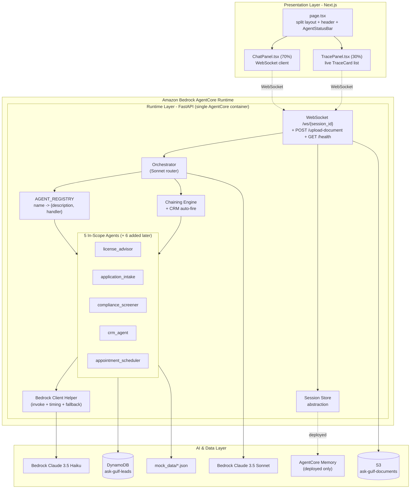
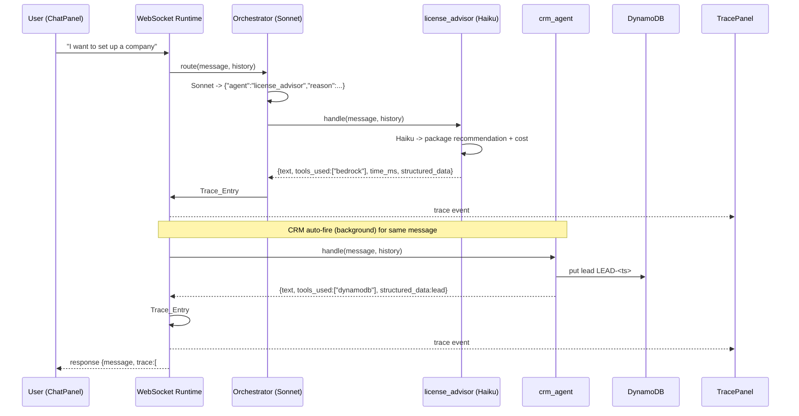
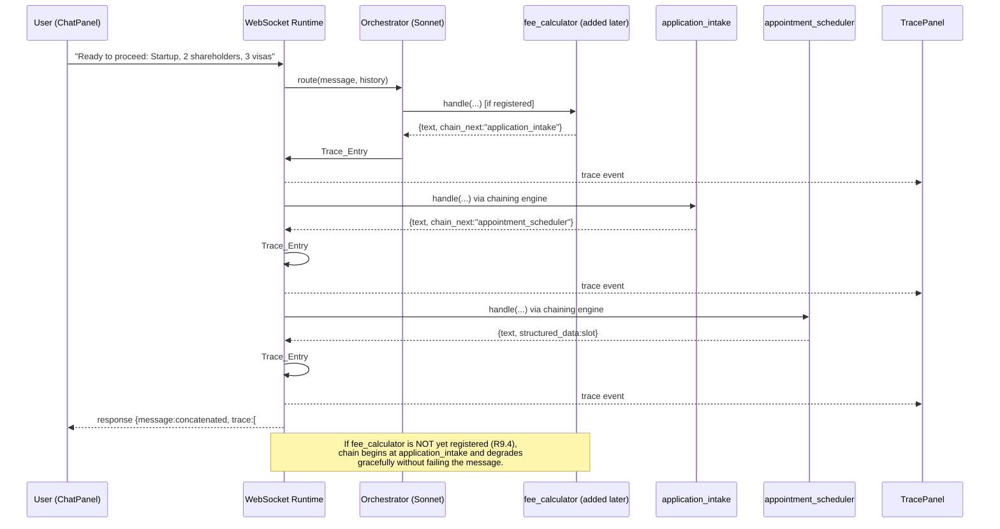

# Design Document

## Overview

Ask Gulf is an agentic AI demonstration for AWS Summit Dubai that presents a fictional GCC free-zone business setup authority. This design covers the in-scope subset: an **Orchestrator** routing brain, five **Specialist Agents** (License Advisor, Application Intake, Compliance Screener, CRM Agent, Appointment Scheduler), a **Next.js split-panel frontend**, **Terraform** infrastructure automation, a **local-first** development workflow, and deployment to **Amazon Bedrock AgentCore Runtime**.

The central experience is a split-panel UI: a chat panel on the left (70%) and a live orchestration trace panel on the right (30%) that lets an audience "see the AI thinking" in real time — which agent was selected, why, which tools and data stores it used, and how long each step took.

### Design Goals

1. **Router, not responder.** The Orchestrator uses Bedrock (Claude 3.5 Sonnet) to reason over agent descriptions and select exactly one specialist. It never generates an answer of its own (R1).
2. **Zero-touch extensibility.** The remaining six agents (Document Verifier, Fee Calculator, Knowledge Agent, Status Tracker, Renewal Agent, Feedback Agent) can be added by dropping in an agent module and an `AGENT_REGISTRY` entry — with **no change to the Orchestrator** (R2, R9.4).
3. **Never stalls on stage.** Every Bedrock error or timeout degrades to a pre-defined fallback response rather than failing the message (R10).
4. **Live, incremental trace.** Every agent invocation emits a `Trace_Entry` streamed to the frontend as it happens, so one message can produce several trace entries visible in sequence (R7, R9, R11).
5. **Local-first, then AgentCore.** The same code runs locally under an AWS SSO profile and, unchanged, inside a single AgentCore Runtime container using an execution role and AgentCore Memory (R16, R18).

### Key Deviations from the Developer Guide (authoritative per user decision)

| Area | Guide | This design |
|------|-------|-------------|
| Deployment target | EC2/ECS with `.env` keys | Amazon Bedrock AgentCore Runtime |
| Local credentials | Static access keys | AWS SSO profile |
| Infrastructure | Manual / scripts | Terraform |
| Packaging | Per-service | Orchestrator + 5 agents in one AgentCore container |
| Session state | In-memory dict only | Session-store abstraction: in-memory locally, AgentCore Memory when deployed |

### Requirements Coverage Summary

This design addresses R1–R19. A traceability table appears at the end of the document.

## Architecture

### System Layers

The system is three layers plus AWS managed services:

1. **Presentation** — Next.js/React split-panel UI communicating over a single WebSocket connection.
2. **Runtime** — FastAPI application hosting the Orchestrator, the `AGENT_REGISTRY`, the five agents, the chaining engine, the CRM auto-fire hook, and a session-store abstraction. This whole application is what gets packaged into the AgentCore Runtime container.
3. **AI & Data** — Amazon Bedrock (Claude Sonnet for routing, Haiku for agents), DynamoDB (`ask-gulf-leads`), S3 (`ask-gulf-documents`), and local mock JSON files. AgentCore Memory backs session state when deployed.



### Message Flow (high level)

1. The client sends message text over `/ws/{session_id}`.
2. The runtime loads conversation history from the session store.
3. The Orchestrator calls Bedrock Sonnet with the agent descriptions, parses `{"agent","reason"}`, and resolves the handler from `AGENT_REGISTRY` (falling back to the default agent on any anomaly).
4. The selected agent runs, returns its contract response, and the runtime emits a `Trace_Entry` streamed to the client.
5. Post-processing hooks run: **CRM auto-fire** (if the License Advisor ran) and the **chaining engine** (if the response carries a `chain_next` flag). Each additional agent invocation emits another `Trace_Entry`.
6. A final `response` message carries the concatenated text and the accumulated trace.
7. Conversation history is appended (one user turn, one assistant turn) and saved.

### Scenario 1 — License Advisor + background CRM (R7, R19.1)



### Scenario 4 — Fee Calculator → Application Intake → Appointment Scheduler chain (R9.3, R19.3)



## Components and Interfaces

### 1. Orchestrator (`backend/orchestrator.py`) — R1

The Orchestrator is a pure router. Responsibilities:

- Receive every user message before any specialist (R1.1).
- Build a routing prompt listing each registered agent's `name` and `Agent_Description` (R1.2, R1.3). No keyword matching or `if/else` branching decides the agent.
- Call Bedrock **Sonnet** and expect strict JSON `{"agent": "<name>", "reason": "<= 200 chars>"}` (R1.2), with a 30-second selection budget (R1.4).
- Resolve `AGENT_REGISTRY[name]["handler"]` and invoke it with `(user_message, conversation_history)` (R1.4).
- Return the specialist's response verbatim to the caller — never its own answer (R1.9, R1.10).
- Emit a `Trace_Entry` with `agent_selected`, `routing_reason`, `tools_used`, `time_ms` (R1.11).

**Fallback routing (default agent).** A single `DEFAULT_AGENT` constant (initially `license_advisor`, the safest general responder for this demo) is used whenever routing cannot confidently resolve a valid agent. The routing reason is set to a distinct string per case:

| Condition | Requirement | routing_reason |
|-----------|-------------|----------------|
| Selection exceeds 30s | R1.5 | `"routing timed out; using default agent"` |
| Output not valid JSON / malformed | R1.6 | `"malformed selection output; using default agent"` |
| `agent` not in registry | R1.7 | `"unknown agent name; using default agent"` |
| No confident match | R1.8 | `"no confident match; using default agent"` |

In all four cases the message is still processed (never failed). "No confident match" is signalled by the model returning `{"agent": "none"}` or a `confidence` below threshold; the Orchestrator treats it as fallback.

Interface:

```python
class Orchestrator:
    def __init__(self, registry: dict, bedrock, default_agent: str = "license_advisor"): ...
    def route(self, user_message: str, history: list[dict]) -> RoutingDecision:
        """Returns the selected agent name + routing_reason. Never raises for
        malformed/unknown/timeout/no-match: falls back to default_agent."""
```

`route` only *selects*; the runtime invokes the handler so that the same trace/chaining machinery wraps every invocation uniformly.

### 2. Agent Registry & Registration (`backend/agents/__init__.py`) — R2

`AGENT_REGISTRY` is a dict mapping a unique agent `name` to `{"description": str, "handler": callable}` (R2.1). Registration is **import-safe**:

- On package load, each in-scope agent module is imported inside a guarded loop. A successful import calls `register(name, description, handler)` (R2.2).
- Each description is validated to 1–14 words; a violation is an error indication and the agent is excluded (R2.3).
- If a module import raises, that agent is skipped, all others are retained, and an error indication naming the failed agent is produced (R2.6).
- If a name is registered twice, the duplicate is rejected, the first record is kept, and an error indication names the duplicate (R2.7).

```python
AGENT_REGISTRY: dict[str, dict] = {}
_REGISTRATION_ERRORS: list[str] = []

def register(name: str, description: str, handler) -> None:
    words = description.split()
    if not (1 <= len(words) <= 14):
        _REGISTRATION_ERRORS.append(f"{name}: description must be 1-14 words")
        return
    if name in AGENT_REGISTRY:
        _REGISTRATION_ERRORS.append(f"duplicate agent name rejected: {name}")
        return
    AGENT_REGISTRY[name] = {"description": description, "handler": handler}

_IN_SCOPE = [
    "license_advisor", "application_intake", "compliance_screener",
    "crm_agent", "appointment_scheduler",
    # teammates append e.g. "fee_calculator", "document_verifier", ... here
]

for _mod in _IN_SCOPE:
    try:
        importlib.import_module(f"agents.{_mod}").register_agent()
    except Exception as e:  # noqa: BLE001 - skip failed agent, keep the rest
        _REGISTRATION_ERRORS.append(f"import failed for {_mod}: {e}")
```

**Extensibility contract (R2.4).** A new agent is added by (1) creating `agents/<name>.py` exposing `register_agent()` that calls `register(...)`, and (2) appending `<name>` to `_IN_SCOPE` (or auto-discovering modules in the directory). The Orchestrator reads the registry at decision time (R2.5) and requires no edits. Because the routing prompt is generated from registry descriptions, the new agent becomes routable automatically.

### 3. Agent Handler Contract & Shared Bedrock Helper — R3, R10

Every agent exposes a uniform handler:

```python
def handle(user_message: str, conversation_history: list[dict]) -> AgentResponse
```

`AgentResponse` (a dict) fields:

| Field | Type | Required | Notes |
|-------|------|----------|-------|
| `text` | non-empty str | yes | The user-facing response (R3.3) |
| `tools_used` | list[str] | yes | AWS service identifiers, e.g. `["bedrock","dynamodb"]`; `["fallback-mode"]` on fallback (R3.3, R10.2) |
| `time_ms` | int ≥ 0 | yes | Elapsed ms from invocation start to completion (R3.4) |
| `structured_data` | dict | optional | Present when the agent produces structured output (R3.5) |
| `chain_next` | str | optional | Name of the next agent to invoke (R9.1) |

A response that violates the contract (empty text, missing field, wrong type) is **rejected**: conversation history is left unchanged and an error indication naming the violation is returned to the caller (R3.7).

**Shared helper (`backend/bedrock_client.py`)** centralises Bedrock invocation, timing, and fallback so agents don't repeat boilerplate:

```python
def invoke_agent(*, system_prompt, user_message, history, model_id=HAIKU,
                 tools_used, fallback_text, timeout_s) -> AgentResponse:
    """Times the call, invokes Bedrock invoke_model (anthropic_version
    'bedrock-2023-05-31'), and on error/timeout returns fallback_text with
    tools_used=['fallback-mode'] (R10.1, R10.2)."""
    start = time.perf_counter()
    try:
        text = _bedrock_invoke(model_id, system_prompt, user_message, history, timeout_s)
        return {"text": text, "tools_used": tools_used,
                "time_ms": _elapsed_ms(start)}
    except (BedrockError, TimeoutError):
        return {"text": fallback_text, "tools_used": ["fallback-mode"],
                "time_ms": _elapsed_ms(start)}
```

**Alternate signature note (future document_verifier).** The Document Verifier will take a `file_key` (S3 object) and use Bedrock vision rather than a text `user_message`. The contract accommodates this by treating `handle`'s first argument as the "input payload": text agents pass the message string; the document verifier module will expose `handle(file_key, conversation_history)` and still return the same `AgentResponse` shape, so the trace/chaining machinery is unchanged.

### 4. The Five In-Scope Agents

Each agent module exposes `register_agent()` and `handle(...)`. Agents use **Haiku** for speed (R3.6). System-prompt summaries and per-agent contract details follow. Every agent has a concrete `Fallback_Response` (R10.3).

#### 4.1 License Advisor (`agents/license_advisor.py`) — R4

- **Description:** "Recommends one of four license packages by activity, team size, and timeline."
- **System prompt summary:** Elicit the three required attributes (business activity, team size, timeline). If any are missing, ask 1–2 clarifying questions targeting only the missing ones (R4.1). With all three, recommend exactly one of: **Idea** AED 6,600/yr (solo founder), **Seed** AED 12,500/yr (1–2 visas), **Startup** AED 22,000/yr (3 visas + flex office), **Growth** AED 45,000/yr (10 visas + premium office) (R4.2). Include annual cost in AED and a reason (R4.3), max 149 words (R4.4). If requirements exceed Growth, offer a custom quote (R4.5).
- **Tools:** `["bedrock"]`.
- **structured_data:** `{recommended_package, annual_cost_aed, reason}`.
- **Fallback (R4.6, 10s budget):** *"Our licensing options range from the Idea package at AED 6,600/year for solo founders to the Growth package at AED 45,000/year for larger teams. A relationship manager can walk you through the best fit."*

#### 4.2 Application Intake (`agents/application_intake.py`) — R5

- **Description:** "Collects application fields one at a time and saves a draft application."
- **System prompt summary:** Request one field at a time in order: company name, business activity, package type, number of shareholders, primary shareholder nationality, contact email (R5.1). Store a valid value and advance to the next uncollected field (R5.2). On invalid input, reject, retain prior values, state which field is invalid and its expected format, and re-request (R5.3). If multiple values are given at once, accept only the currently requested field's value and ignore the rest (R5.4). **Validations:** shareholders is an integer 1–50 inclusive (R5.5); email has a single `@` separating a non-empty local part and a domain containing at least one `.`, and ≤ 254 chars (R5.6). When all six are collected, present a labelled summary (R5.7) and save a draft to DynamoDB (R5.8). On save failure, retain values, tell the user the draft could not be saved, and do not claim success (R5.9). On success, tell the user a relationship manager will contact within 24 hours (R5.10).
- **Tools:** `["bedrock","dynamodb"]`.
- **structured_data:** `{application_id, status:"DRAFT", fields:{...}, created_at}`.
- **Fallback:** *"I can help you start an application. Let's begin with your company name — you can also reach a relationship manager who will complete the details with you."*

#### 4.3 Compliance Screener (`agents/compliance_screener.py`) — R6

- **Description:** "Screens a name and identifier against a mock sanctions and PEP watchlist."
- **System prompt summary:** Parse a name and an identifier from the message (R6.1). If either is missing, ask for the missing item without failing (R6.2). Check both against the watchlist using **case-insensitive exact match** — a match occurs if the name exactly matches (ignoring case) a watchlist entry name OR any provided identifier exactly matches (ignoring case) any identifier in that entry's identifiers list (R6.3). Return within 5s a structured result with result label, name, identifier, status, lists checked, timestamp, and evidence (R6.4). Lists checked are reported as **OFAC SDN, UN Consolidated, EU Sanctions** (R6.5). One match → status `flagged`, requires manual review, evidence identifies the matching list and reason (R6.6). Multiple matches → `flagged`, evidence identifies all lists and reasons (R6.7). No match → status `clear`, cleared to proceed, evidence states no matches found (R6.8).
- **Tools:** `["s3"]` (watchlist read; local reads a JSON file, deployed reads from S3/mock).
- **structured_data:** the `Screening_Result` (see Data Models).
- **Fallback:** *"Screening is temporarily unavailable. Please retry shortly, or a compliance officer can run a manual check against OFAC SDN, UN Consolidated, and EU Sanctions lists."*

Note: the screener is largely deterministic (matching over the watchlist); Bedrock is used only to parse the name/identifier from free text, and the match logic runs in code so it is testable and fast.

#### 4.4 CRM Agent (`agents/crm_agent.py`) — R7

- **Description:** "Creates a NEW lead record in DynamoDB after a licensing conversation."
- **System prompt summary:** Create a lead record in DynamoDB with `lead_id` = `LEAD-<timestamp>`, `source` = `aws-summit-demo`, `status` = `NEW`, an interaction summary, and a creation timestamp (R7.2). Use the DynamoDB tool (R7.3). Return a confirmation and the lead record as structured data (R7.4).
- **Tools:** `["dynamodb"]`.
- **structured_data:** the lead record.
- **Auto-fire (R7.1, R7.5):** invoked by the runtime in the background after the License Advisor completes, for the same message, producing a second `Trace_Entry` (two entries for one message).
- **Fallback:** *"Your interest has been noted. A relationship manager will follow up shortly."*

#### 4.5 Appointment Scheduler (`agents/appointment_scheduler.py`) — R8

- **Description:** "Books an available slot with a relationship manager from the calendar."
- **System prompt summary:** Read available slots from the calendar; each slot has `slot_id`, `date`, `time`, `rm_name`, `booked` (R8.1). Select a slot whose `booked` flag is not set (R8.2). Return the confirmed slot details and a calendar event (R8.3).
- **Tools:** `["s3"]` (calendar read).
- **structured_data:** `{slot_id, date, time, rm_name, calendar_event}`.
- **Fallback:** *"I can book you a meeting with a relationship manager. Our next available slots are on weekday mornings — please retry to confirm one."*

### 5. Chaining Engine — R9

After a primary agent returns, the runtime inspects the response for a `chain_next` flag. If present and the named agent exists in the registry, it invokes that agent with the same message/history, appends its `text` to the running response, and appends a `Trace_Entry` (R9.1, R9.2). The loop repeats while each response supplies a `chain_next`. A guard caps chain length (e.g. 5) to prevent cycles.

**Graceful degradation (R9.4):** if a `chain_next` names an agent that is not in the registry (e.g. `fee_calculator` not yet added), the engine logs a skip, continues with whatever agents are available, and does not fail the message. In Scenario 4, if `fee_calculator` is absent, routing begins at `application_intake` and the chain proceeds from there.

```python
def run_chain(first_agent, message, history, registry, emit_trace):
    current, steps, seen = first_agent, [], set()
    while current and current not in seen and len(seen) < 5:
        seen.add(current)
        rec = registry.get(current)
        if rec is None:           # missing chained agent -> skip, don't fail (R9.4)
            break
        resp = _invoke(rec["handler"], message, history)
        emit_trace(current, resp)  # live Trace_Entry per step (R9.2, R11.2)
        steps.append(resp)
        current = resp.get("chain_next")
    return steps
```

### 6. CRM Auto-Fire Hook — R7

A post-processing hook: if the agent selected by the Orchestrator was `license_advisor` and it completed, the runtime invokes `crm_agent` in the background for the same message and emits its `Trace_Entry`. This is distinct from chaining (it is not driven by `chain_next`) and yields exactly two trace entries for the one message (R7.1, R7.5).

### 7. Session Store Abstraction — R16, R18

A small interface decouples session/conversation state from its backing store, selected by the `DEPLOYMENT_MODE` flag:

```python
class SessionStore(Protocol):
    def get_history(self, session_id: str) -> list[dict]: ...
    def append_turn(self, session_id: str, role: str, content: str) -> None: ...

class InMemorySessionStore:   # local-first: dict keyed by session_id
class AgentCoreMemorySessionStore:  # deployed: backed by AgentCore Memory (R18.3)
```

Each user message appends exactly one user turn and one assistant turn (R14/R3 uniformity). Selection: `InMemorySessionStore` when `DEPLOYMENT_MODE == "local"`, `AgentCoreMemorySessionStore` when `"agentcore"`.

### 8. WebSocket Protocol & HTTP Endpoints — R11

**`/ws/{session_id}`** (R11.1): the client sends message text; the server responds with a stream that supports **multiple trace entries per message** so the trace panel updates live (R11.2, R11.4):

- `{"type":"trace", "entry": Trace_Entry}` — emitted per agent invocation, in real time as each completes.
- `{"type":"response", "message": "<concatenated text>", "trace": [Trace_Entry, ...]}` — the final message with the full accumulated trace.

Emitting incremental `trace` events (rather than only a final bundle) is what makes the panel animate as the orchestrator, CRM auto-fire, and chain steps complete.

**`POST /upload-document`** — accepts a file, stores it in the `ask-gulf-documents` S3 bucket, and returns the `file_key` for the future Document Verifier. On failure returns an error status without claiming success.

**`GET /health`** — returns runtime health for AgentCore and local checks.

### 9. Frontend Components (`frontend/`) — R12

- **`src/app/page.tsx`** — split layout (Chat 70% / Trace 30%), header with Ask Gulf branding, and an `AgentStatusBar` (R12.1, R12.2).
- **`ChatPanel.tsx`** — owns the WebSocket connection, renders message list, and the input box; sends text and consumes `response` events.
- **`MessageBubble.tsx`** — a single chat message (user/assistant styling).
- **`TracePanel.tsx`** — subscribes to `trace` events and renders a live list of `TraceCard`s; shows AWS badges for Bedrock, DynamoDB, S3 (R11.3, R12.3).
- **`TraceCard.tsx`** — one `Trace_Entry`: agent name, `time_ms`, `routing_reason`, and `tools_used` badges.
- **`tailwind.config.js`** + `globals.css` — GulfKloud theme (see Config model / R12.4).

## Data Models

### Trace_Entry (R1.11, R11.3)

```json
{
  "agent_selected": "license_advisor",
  "routing_reason": "User wants to start a company; matches licensing.",
  "tools_used": ["bedrock"],
  "time_ms": 842
}
```

Every field is required; `time_ms` is a non-negative integer.

### Agent Response Contract (R3)

```json
{
  "text": "The Startup package at AED 22,000/year fits three visas...",
  "tools_used": ["bedrock"],
  "time_ms": 842,
  "structured_data": { "recommended_package": "Startup", "annual_cost_aed": 22000 },
  "chain_next": "application_intake"
}
```

`text`, `tools_used`, `time_ms` are required; `structured_data` and `chain_next` are optional.

### WebSocket Message Schemas (R11)

```json
// client -> server
{ "text": "I want to set up a company" }

// server -> client (incremental, one per agent invocation)
{ "type": "trace", "entry": { /* Trace_Entry */ } }

// server -> client (final)
{ "type": "response", "message": "<full text>", "trace": [ /* Trace_Entry, ... */ ] }
```

### DynamoDB `ask-gulf-leads` (single-table; R14.4, R14.5)

The one table holds both lead records and draft application records, distinguished by a `pk` prefix and an `entity_type` attribute.

**Key design:** partition key `pk` (string), no sort key needed for the demo.

Lead record (R7.2):

```json
{
  "pk": "LEAD-1737045600",
  "entity_type": "lead",
  "lead_id": "LEAD-1737045600",
  "source": "aws-summit-demo",
  "status": "NEW",
  "interaction_summary": "Interested in Startup package for 3 visas.",
  "created_at": "2026-01-16T18:00:00Z"
}
```

Draft application record (R5.8):

```json
{
  "pk": "APP-2026-0042",
  "entity_type": "application",
  "application_id": "APP-2026-0042",
  "status": "DRAFT",
  "company_name": "Acme FZ-LLC",
  "business_activity": "Software development",
  "package_type": "Startup",
  "number_of_shareholders": 2,
  "primary_shareholder_nationality": "Indian",
  "contact_email": "founder@acme.example",
  "created_at": "2026-01-16T18:05:00Z"
}
```

`application_id` format `APP-2026-XXXX` with a four-digit sequence 0000–9999; `created_at` is ISO 8601 UTC.

### Mock Data JSON Schemas (`backend/mock_data/`; R14.1)

**`watchlist.json`** (R6, R14.2):

```json
[
  {
    "name": "John Doe",
    "identifiers": ["P1234567", "AB998877"],
    "list": "OFAC SDN",
    "reason": "Listed for sanctions evasion (mock)."
  }
]
```

**`calendar.json`** (R8, R14.3):

```json
[
  { "slot_id": "SLOT-001", "date": "2026-01-20", "time": "10:00", "rm_name": "Layla Hassan", "booked": false },
  { "slot_id": "SLOT-002", "date": "2026-01-20", "time": "11:30", "rm_name": "Omar Farouk", "booked": true }
]
```

**`fee_schedule.json`** (used by the later Fee Calculator; included so the chain data exists):

```json
{
  "packages": {
    "Idea":    { "base_aed": 6600,  "visa_included": 0 },
    "Seed":    { "base_aed": 12500, "visa_included": 2 },
    "Startup": { "base_aed": 22000, "visa_included": 3 },
    "Growth":  { "base_aed": 45000, "visa_included": 10 }
  },
  "per_extra_visa_aed": 3500,
  "office_flex_aed": 5000,
  "office_premium_aed": 15000
}
```

**`applications.json`** (seed/sample draft applications):

```json
[
  {
    "application_id": "APP-2026-0001",
    "status": "DRAFT",
    "company_name": "Sample FZ-LLC",
    "business_activity": "Consulting",
    "package_type": "Seed",
    "number_of_shareholders": 1,
    "primary_shareholder_nationality": "Emirati",
    "contact_email": "sample@example.com",
    "created_at": "2026-01-10T09:00:00Z"
  }
]
```

Additional files `companies.json`, `faq.json`, `renewals.json` are reserved for teammates' later agents and are not read by the in-scope five.

### Configuration / Environment Model (R12.4, R16, R18)

No secrets in source (R16.1, R16.4). Configuration is read from environment/config with these keys:

```python
@dataclass
class Config:
    aws_region: str = "us-east-1"
    sonnet_model_id: str = "anthropic.claude-3-5-sonnet-20241022-v2:0"
    haiku_model_id: str = "anthropic.claude-3-5-haiku-20241022-v1:0"
    anthropic_version: str = "bedrock-2023-05-31"
    dynamodb_table: str = "ask-gulf-leads"
    s3_bucket: str = "ask-gulf-documents"
    aws_sso_profile: str | None = None      # local dev only (R16.2)
    deployment_mode: str = "local"          # "local" | "agentcore" (R18)
    default_agent: str = "license_advisor"
```

- **Local:** boto3 sessions resolve credentials from the SSO profile (`aws sso login`); `deployment_mode="local"` selects the in-memory session store (R16.2, R18.1).
- **Deployed:** credentials come from the AgentCore execution role; `deployment_mode="agentcore"` selects AgentCore Memory (R16.3, R18.2, R18.3).

**GulfKloud theme colors** (R12.4), surfaced in `tailwind.config.js`:

```
navy #0A1628 · navy-dark #060F1E · mid #0D1F35 · blue #2196F3 · blue-light #E3F2FD
white #FFFFFF · secondary #A0AEC0 · success #27AE60 · warning #F5A623 · error #E74C3C · card #1A2D42
```

### Confidential Names Guardrail (R13)

`CONFIDENTIAL_NAMES = ["Innovation City", "Skynet", "Ask Sky", "EMB Global", "Mantarav"]`. These MUST never appear in any UI element or agent response (R13.1, R13.2). Enforced by: (1) never placing them in prompts, mock data, or code strings; (2) an automated scan test over source, mock data, and generated responses (see Testing Strategy).

## Correctness Properties

*A property is a characteristic or behavior that should hold true across all valid executions of a system — essentially, a formal statement about what the system should do. Properties serve as the bridge between human-readable specifications and machine-verifiable correctness guarantees.*

The properties below were derived from the acceptance-criteria prework and consolidated to remove redundancy (e.g. single/multiple-match screening merged into one; the chaining scenarios merged into one chain-length property). Each property is universally quantified and maps to the requirements it validates.

### Property 1: Every message yields a trace and a response

*For any* user message, processing produces at least one `Trace_Entry` and returns a non-empty response text, and the conversation history grows by exactly one user turn and one assistant turn.

**Validates: Requirements 1.11, 3.3, 11.2**

### Property 2: Orchestrator is a router, not a responder

*For any* user message, the final response text originates entirely from the selected specialist agent(s); the Orchestrator contributes no answer text of its own.

**Validates: Requirements 1.9, 1.10**

### Property 3: Routing respects the registry snapshot

*For any* registry state and any user message, the routing decision resolves to an agent name present in the registry at decision time, or to the default agent; a newly registered agent whose description best matches the message is selectable using the unchanged Orchestrator.

**Validates: Requirements 2.4, 2.5, 1.2**

### Property 4: Anomalous selection always falls back without failing

*For any* user message, when Bedrock selection times out, returns malformed/non-JSON output, names an agent absent from the registry, or produces no confident match, the decision resolves to the default agent, records a routing reason, and the message is still processed (never failed).

**Validates: Requirements 1.5, 1.6, 1.7, 1.8**

### Property 5: Trace entries are well-formed

*For any* produced `Trace_Entry`, it contains `agent_selected`, `routing_reason`, `tools_used` (a list), and `time_ms` with `time_ms >= 0`.

**Validates: Requirements 1.11, 3.4, 11.3**

### Property 6: Registry entries are well-formed and descriptions bounded

*For any* registered agent, its record has exactly one description (a string of 1–14 words) and one callable handler, and every registered name is unique.

**Validates: Requirements 2.1, 2.3**

### Property 7: Registration is resilient

*For any* set of agent modules where an arbitrary subset fails to import or attempts a duplicate name, all successfully and uniquely registered agents remain in the registry, each failed/duplicate is excluded, and an error indication names each failure.

**Validates: Requirements 2.6, 2.7**

### Property 8: Agent responses satisfy the contract

*For any* agent and any user message, the returned response has a non-empty `text`, a list `tools_used`, and an integer `time_ms >= 0`.

**Validates: Requirements 3.3, 3.4**

### Property 9: Contract violations are rejected safely

*For any* agent response that violates the contract, the runtime rejects it, leaves the conversation history unchanged, and returns an error indication naming the violation.

**Validates: Requirements 3.7**

### Property 10: Fallback path is uniform

*For any* agent, when its Bedrock call errors or times out, the response text equals that agent's predefined `Fallback_Response` and `tools_used == ["fallback-mode"]`.

**Validates: Requirements 4.6, 10.1, 10.2**

### Property 11: License recommendation is well-formed

*For any* request supplying all three attributes (business activity, team size, timeline) within the Growth tier, the License Advisor recommends exactly one of {Idea, Seed, Startup, Growth}, includes its annual AED cost and a reason, and the recommendation text is at most 149 words.

**Validates: Requirements 4.2, 4.3, 4.4**

### Property 12: Requirements beyond Growth yield a custom quote

*For any* request whose stated requirements exceed the Growth tier, the License Advisor offers a custom quote rather than a fixed package.

**Validates: Requirements 4.5**

### Property 13: Intake collects fields in order and advances on valid input

*For any* valid input for the currently requested field, the Application Intake stores that value and next requests the next uncollected field in the fixed order (company name, business activity, package type, number of shareholders, primary shareholder nationality, contact email).

**Validates: Requirements 5.1, 5.2**

### Property 14: Invalid input is rejected without losing state

*For any* input that fails validation for the currently requested field, the Application Intake retains all previously collected values, re-requests the same field, and reports which field is invalid and its expected format.

**Validates: Requirements 5.3, 5.5, 5.6**

### Property 15: Only the current field is accepted from multi-value input

*For any* single response containing values for multiple fields, the Application Intake stores only the value for the currently requested field and ignores the rest, preserving the collection order.

**Validates: Requirements 5.4**

### Property 16: Shareholder and email validators are exact

*For any* candidate value, the shareholder value is accepted if and only if it is an integer in [1, 50]; a contact email is accepted if and only if it has a single `@` separating a non-empty local part from a domain containing at least one `.` and is at most 254 characters.

**Validates: Requirements 5.5, 5.6**

### Property 17: Completed intake summarizes and saves a valid draft

*For any* complete set of six field values, the Application Intake presents a summary containing every field label and value, and (on successful save) persists a DynamoDB item whose `application_id` matches `APP-2026-XXXX` (four digits), `status == "DRAFT"`, contains all six field values, and has an ISO 8601 UTC `created_at`; and informs the user of contact within 24 hours.

**Validates: Requirements 5.7, 5.8, 5.10, 14.5**

### Property 18: Draft save failure never reports success

*For any* simulated DynamoDB save failure, the Application Intake retains the collected values, tells the user the draft could not be saved, and does not report successful submission.

**Validates: Requirements 5.9**

### Property 19: Screening classification is correct with full evidence

*For any* watchlist and any parseable name/identifier, the screening status is `flagged` if and only if there is at least one case-insensitive exact match (name equals an entry name, or a provided identifier equals an entry identifier); when flagged, the evidence identifies every matching list and reason; when there is no match, the status is `clear` and the evidence states no matches were found. The lists checked are always OFAC SDN, UN Consolidated, EU Sanctions.

**Validates: Requirements 6.3, 6.5, 6.6, 6.7, 6.8**

### Property 20: Missing screening input asks rather than fails

*For any* message lacking a parseable name or identifier, the Compliance Screener requests the missing item and does not terminate in a failure state.

**Validates: Requirements 6.2**

### Property 21: Screening result is structurally complete

*For any* parseable name and identifier, the screening result contains the result label, name, identifier, status, lists checked, timestamp, and evidence.

**Validates: Requirements 6.4**

### Property 22: License routing auto-fires CRM and yields two traces

*For any* message routed to the License Advisor, the runtime also invokes the CRM Agent in the background for the same message, and exactly two `Trace_Entry` records are produced for that message.

**Validates: Requirements 7.1, 7.5, 19.1**

### Property 23: CRM produces a well-formed lead

*For any* CRM invocation, a DynamoDB lead record is created with `lead_id` matching `LEAD-<timestamp>`, `source == "aws-summit-demo"`, `status == "NEW"`, an interaction summary, and a creation timestamp; `tools_used` includes `"dynamodb"`; and the lead is returned as `structured_data`.

**Validates: Requirements 7.2, 7.3, 7.4**

### Property 24: Booking selects an unbooked slot and confirms it

*For any* calendar containing at least one available slot, the Appointment Scheduler selects a slot whose `booked` flag was not set and returns the confirmed slot details and a calendar event.

**Validates: Requirements 8.2, 8.3**

### Property 25: Chaining produces exactly N traces and degrades gracefully

*For any* chain of registered agents of length N (each response supplying the next via `chain_next`), exactly N `Trace_Entry` records are produced and all N response texts are appended; if any referenced next agent is absent from the registry, the chain continues with the available agents and the message is not failed.

**Validates: Requirements 9.1, 9.2, 9.3, 9.4, 19.3**

### Property 26: No confidential name ever surfaces

*For any* generated response text and any `Trace_Entry`, no `Confidential_Name` (Innovation City, Skynet, Ask Sky, EMB Global, Mantarav) appears.

**Validates: Requirements 13.1, 13.2**

### Property 27: Watchlist entries are well-formed

*For any* entry in `watchlist.json`, it contains a `name`, an `identifiers` list, a `list`, and a `reason`.

**Validates: Requirements 14.2**

### Property 28: Trace events are emitted for every trace entry

*For any* message that produces N trace entries, N incremental `trace` WebSocket events are emitted before the final `response` event.

**Validates: Requirements 11.2, 11.4**

## Error Handling

| Failure | Handling | Requirement |
|---------|----------|-------------|
| Bedrock selection timeout (>30s) | Route to default agent; routing_reason notes timeout; continue | R1.5 |
| Malformed / non-JSON routing output | Route to default agent; routing_reason notes malformed output; continue | R1.6 |
| Unknown agent name from model | Route to default agent; routing_reason notes unknown name; continue | R1.7 |
| No confident match | Route to default agent; routing_reason notes no match; continue | R1.8 |
| Bedrock error/timeout in an agent | Return agent's `Fallback_Response`; `tools_used=["fallback-mode"]`; message still returned | R10.1, R10.2 |
| Agent returns contract-violating response | Reject; keep history unchanged; return error indication naming the violation | R3.7 |
| Agent module import failure | Skip agent; keep others; record error naming the failed agent | R2.6 |
| Duplicate agent registration | Reject duplicate; keep first record; record error naming the duplicate | R2.7 |
| Chained agent missing from registry | Skip that step; continue with available agents; do not fail the message | R9.4 |
| DynamoDB draft save failure | Retain collected values; tell user the draft could not be saved; do not claim success | R5.9 |
| Compliance input missing name/identifier | Ask for the missing item; do not enter a failure state | R6.2 |
| S3 upload failure (`/upload-document`) | Return an error status; do not return a `file_key` or claim success | R14 (upload path) |
| WebSocket disconnect | Server drops the connection cleanly; session state persists in the session store keyed by `session_id`; client reconnects to `/ws/{session_id}` and resumes with retained history | R11.1, R18.3 |
| Chain cycle / runaway | Chain length capped (guard set, max 5); loop terminates | R9 |

## Testing Strategy

Testing is **local-first**: the full suite runs locally under the AWS SSO profile with Bedrock, DynamoDB, and S3 mocked before any AgentCore deployment. Deployment adds a small set of integration and smoke checks.

### Dual Approach

- **Unit tests** cover specific examples, edge cases, and error conditions (with Bedrock mocked).
- **Property-based tests** verify the universal invariants in the Correctness Properties section across many generated inputs.

Both are necessary: unit tests pin concrete behavior and integration points; property tests give broad input coverage.

### Property-Based Testing

PBT **is appropriate** here because the core logic — routing resolution/fallback, the registry, the agent response contract, input validation, watchlist matching, chaining counts, and the confidential-name guardrail — are pure or mock-isolatable functions with universal properties over large input spaces.

- Library: **Hypothesis** (Python).
- Each property test runs a **minimum of 100 iterations**.
- Bedrock is mocked so 100+ iterations are fast and cost-free; DynamoDB/S3 are mocked (e.g. `moto`) or stubbed.
- Each property test is tagged with a comment referencing its design property:
  `# Feature: ask-gulf, Property {number}: {property_text}`
- Each of Properties 1–28 is implemented by a **single** property-based test.

Notable generators:
- Random messages + random registry contents (Properties 3, 4).
- Arbitrary malformed strings for routing output (Property 4).
- Random watchlists + name/identifier inputs, including case variations and overlapping identifiers (Property 19).
- Random field values including boundary shareholders (0, 1, 50, 51) and adversarial emails (Properties 14, 16).
- Random chain lengths and registries missing an agent (Property 25).
- Response/trace text seeded to sometimes include confidential substrings to prove the scan catches them (Property 26).

### Unit / Example Tests

- **Orchestrator routing:** prompt is built from registry descriptions (no keyword table) (R1.3); each fallback case records its distinct routing reason (R1.5–1.8).
- **Per agent (Bedrock mocked):** License Advisor clarifying-question path and custom-quote path (R4.1, R4.5); Compliance parsing (R6.1) and fixed lists (R6.5); Scheduler slot fields (R8.1); each agent has a non-empty fallback (R10.3); structured_data presence (R3.5); specialists invoke the Haiku model id (R3.6).
- **Registry init:** all in-scope agents registered (R2.2).
- **Contract tests:** a shared parametrized test asserts every registered agent's `handle` returns the `AgentResponse` shape (R3) — this is the guard for teammates' future agents.
- **Scenario tests:** Scenario 1 routes to License Advisor + CRM with two traces (R19.1); Scenario 2 routes to Compliance Screener with a structured evidence result (R19.2); Scenario 4 produces three traces and degrades if `fee_calculator` is absent (R19.3, R9.4).

### Frontend Tests

- Snapshot/DOM tests: 70/30 split, header branding, AWS badges, GulfKloud color tokens (R12.1–12.4); TraceCard renders agent, reason, tools, latency (R11.3); a list of entries renders one card each (R11.4); WebSocket client targets `/ws/{session_id}` (R11.1).

### Confidential-Name Scan

An automated test scans source files, mock data, and a corpus of generated responses/traces to assert no `Confidential_Name` appears (R13). This complements Property 26.

### Security / Credentials

- Secret-scan test: no static AWS keys in source (R16.1); `.gitignore` excludes env/secret files (R16.4).
- Config tests: local mode resolves SSO-profile credentials (R16.2); agentcore mode uses role-based credentials and `AgentCoreMemorySessionStore` (R16.3, R18.3).

### Infrastructure & Integration

- **Terraform:** `terraform validate` plus plan assertions that the DynamoDB table, S3 bucket, IAM roles/policies, and AgentCore runtime resources are declared (R17.1–17.4).
- **Smoke:** mock data files exist and parse (R14.1); local run reaches `/health` (R18.1); seed load populates DynamoDB/S3 (R14.6); post-deploy the single container image exposes the orchestrator + five agents and `/health` (R18.2).
- **Performance:** measure end-to-end latency for representative messages and assert < 3s on a good connection; Haiku for agents supports the target (R15.1).

### Manual Demo Rehearsal

Rehearse the three scripted scenarios end to end (R19.1–19.3), watching the trace panel animate per incremental trace event, and visually confirming no confidential name appears anywhere.

## Deployment

### Local-First (R16, R18.1)

1. `aws sso login --profile <profile>` to obtain credentials (no static keys).
2. `terraform apply` in `infra/` provisions DynamoDB, S3, IAM, and (optionally) AgentCore resources; seed mock data into the stores.
3. Backend: `uvicorn main:app` with `DEPLOYMENT_MODE=local` (in-memory session store, SSO-profile credentials).
4. Frontend: run the Next.js dev server; it connects to the local WebSocket.

### AgentCore Runtime (R18.2, R18.3)

- **Packaging:** the FastAPI app (Orchestrator + `AGENT_REGISTRY` + five agents + chaining + session store) is packaged as a **single container** with an AgentCore runtime entrypoint that wraps the app and exposes agent invocation and the WebSocket/HTTP surface. A `Dockerfile` builds this image.
- **Provisioning:** Terraform (`infra/`) creates the AgentCore runtime deployment resources, the execution role, DynamoDB, and S3 (R17).
- **Deployment-mode switch:** setting `DEPLOYMENT_MODE=agentcore` switches the session store to `AgentCoreMemorySessionStore` and credential resolution to the AgentCore execution role — the same code, no source edits (R16.3, R18.3).
- **Future split:** because agents are isolated behind the registry and the handler contract, individual agents can later be extracted into their own AgentCore runtime agents without changing the Orchestrator.

### Folder Structure

```
ask-gulf/
  backend/
    main.py                 # FastAPI: /ws/{session_id}, /upload-document, /health
    orchestrator.py         # Sonnet router (Orchestrator)
    bedrock_client.py       # shared invoke + timing + fallback helper
    session_store.py        # SessionStore protocol + in-memory + AgentCore Memory
    fallbacks.py            # FALLBACK_RESPONSES per agent
    config.py               # Config dataclass (region, model ids, table, bucket, mode)
    agents/
      __init__.py           # AGENT_REGISTRY + import-safe register()
      license_advisor.py
      application_intake.py
      compliance_screener.py
      crm_agent.py
      appointment_scheduler.py
      # teammates add: fee_calculator.py, document_verifier.py, ... (+ registry entry)
    mock_data/
      watchlist.json  calendar.json  applications.json  fee_schedule.json
      # reserved: companies.json  faq.json  renewals.json
    requirements.txt
    Dockerfile              # AgentCore runtime image
    agentcore_entrypoint.py # wraps FastAPI app for AgentCore Runtime
  frontend/
    package.json  next.config.js  tailwind.config.js
    src/app/page.tsx
    src/components/ChatPanel.tsx  TracePanel.tsx  MessageBubble.tsx  TraceCard.tsx
    src/styles/globals.css
  infra/
    providers.tf            # AWS provider with SSO profile
    dynamodb.tf  s3.tf  iam.tf  agentcore.tf
    variables.tf  outputs.tf
  README.md
```

## Requirements Traceability

| Requirement | Design coverage |
|-------------|-----------------|
| R1 Orchestrator routing | Components §1 (Orchestrator, fallback table); Scenario diagrams; Properties 2, 3, 4, 5 |
| R2 Registry & extensibility | Components §2; Properties 3, 6, 7 |
| R3 Agent contract | Components §3; Data Models (Agent Response Contract); Properties 8, 9 |
| R4 License Advisor | Components §4.1; Properties 10, 11, 12 |
| R5 Application Intake | Components §4.2; Data Models (draft application); Properties 13–18 |
| R6 Compliance Screener | Components §4.3; Data Models (watchlist); Properties 19, 20, 21 |
| R7 CRM auto-fire | Components §4.4, §6; Scenario 1; Properties 22, 23 |
| R8 Appointment Scheduler | Components §4.5; Data Models (calendar); Property 24 |
| R9 Chaining | Components §5; Scenario 4; Property 25 |
| R10 Fallback resilience | Components §3, §4 (fallback strings); Property 10 |
| R11 WebSocket trace | Components §8; Data Models (WS schemas); Properties 1, 5, 28 |
| R12 Split-panel UI/theme | Components §9; Config model (colors); frontend tests |
| R13 Confidential names | Data Models (guardrail); Property 26; scan test |
| R14 Mock data & stores | Data Models (mock schemas, DynamoDB); Properties 17, 27; smoke tests |
| R15 Performance | Testing (performance); Haiku for agents |
| R16 Credentials / SSO | Components §7; Config model; security tests |
| R17 Terraform | Deployment; `infra/`; Terraform tests |
| R18 Local-first & AgentCore | Deployment; Components §7 (mode switch) |
| R19 Demo scenarios | Scenario diagrams; Properties 22, 25; scenario tests |
