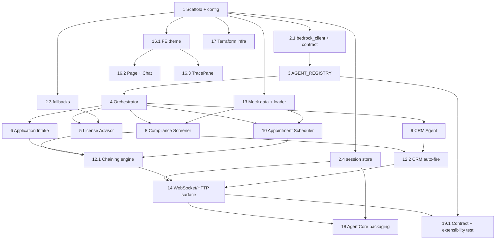

# Implementation Plan: Ask Gulf

## Overview

This plan builds the in-scope Ask Gulf subset local-first and test-driven, in the order the design layers depend on each other: project scaffold and config first, then the shared primitives (config, bedrock_client helper, session store, fallbacks, the import-safe `AGENT_REGISTRY`), then the Orchestrator router with its fallback routing, then the five agents (License Advisor first as the template and default agent), then the chaining engine and CRM auto-fire hook, then the WebSocket/HTTP surface and mock-data loading, then the Next.js split-panel frontend, then the Terraform infrastructure, then the AgentCore packaging with the deployment-mode switch, and finally the cross-cutting test suites (agent-handler contract test, confidential-name scan, secret scan, performance smoke).

The implementation language is **Python** for the backend (FastAPI + boto3) and **TypeScript/Next.js + Tailwind** for the frontend, as specified in the design document. Property-based tests use **Hypothesis** (100+ iterations each), with Bedrock, DynamoDB, and S3 mocked (`moto`/stubs). Each property test is tagged `# Feature: ask-gulf, Property N: ...` and there is exactly one property test per property.

Tasks marked with `*` are optional (nice-to-have) and can be skipped without breaking the demo-critical path. All other sub-tasks are required.

## Tasks

- [x] 1. Scaffold project structure, config, and dependency manifests
  - Create the `backend/`, `frontend/`, and `infra/` directory trees per the design's Folder Structure, plus `backend/agents/` and `backend/mock_data/`.
  - Create `backend/requirements.txt` (fastapi, uvicorn, boto3, websockets, hypothesis, moto, pytest) and `.gitignore` excluding `.env`, credentials, and secret files (R16.4).
  - Implement `backend/config.py` as the `Config` dataclass with aws_region, sonnet/haiku model ids, anthropic_version, dynamodb_table `ask-gulf-leads`, s3_bucket `ask-gulf-documents`, `aws_sso_profile`, `deployment_mode` (`"local"`/`"agentcore"`), and `default_agent = "license_advisor"`. No hardcoded credentials.
  - _Requirements: 16.1, 16.4, 18.1_

- [x] 2. Implement shared runtime primitives
  - [x] 2.1 Implement the `AgentResponse` contract and shared Bedrock helper (`backend/bedrock_client.py`)
    - Define the `AgentResponse` shape (`text` non-empty str, `tools_used` list[str], `time_ms` int>=0, optional `structured_data`, optional `chain_next`).
    - Implement `invoke_agent(...)` that times the call (`time_ms` from start to completion), invokes Bedrock `invoke_model` with anthropic_version `bedrock-2023-05-31`, and on error/timeout returns `fallback_text` with `tools_used=["fallback-mode"]`.
    - Implement a `validate_response(resp)` guard used by the runtime that rejects contract violations and returns an error indication naming the violation, leaving history unchanged.
    - _Requirements: 3.3, 3.4, 3.6, 3.7, 10.1, 10.2_

  - [ ]* 2.2 Write property tests for the response contract and fallback path
    - **Property 8: Agent responses satisfy the contract** — _Validates: Requirements 3.3, 3.4_
    - **Property 9: Contract violations are rejected safely** — _Validates: Requirements 3.7_
    - **Property 10: Fallback path is uniform** — _Validates: Requirements 4.6, 10.1, 10.2_
    - _Properties: 8, 9, 10_

  - [x] 2.3 Implement per-agent fallback responses (`backend/fallbacks.py`)
    - Define `FALLBACK_RESPONSES` with a concrete predefined string for each of the five agents (license_advisor, application_intake, compliance_screener, crm_agent, appointment_scheduler), exactly as written in design §4.
    - _Requirements: 10.3_

  - [x] 2.4 Implement the session-store abstraction (`backend/session_store.py`)
    - Define the `SessionStore` protocol (`get_history`, `append_turn`), `InMemorySessionStore`, and `AgentCoreMemorySessionStore`.
    - Implement a factory selecting the store from `Config.deployment_mode` (in-memory for `local`, AgentCore Memory for `agentcore`).
    - Ensure each processed message appends exactly one user turn and one assistant turn.
    - _Requirements: 16.2, 16.3, 18.3_

  - [ ]* 2.5 Write unit tests for the session-store factory and credential mode
    - Assert `local` mode selects `InMemorySessionStore` and `agentcore` mode selects `AgentCoreMemorySessionStore`.
    - _Requirements: 16.2, 16.3, 18.3_

- [x] 3. Implement the import-safe Agent Registry (`backend/agents/__init__.py`)
  - Implement `AGENT_REGISTRY`, `_REGISTRATION_ERRORS`, and `register(name, description, handler)` validating descriptions to 1–14 words, rejecting duplicates (keep first, record error naming the duplicate).
  - Implement the guarded import loop over `_IN_SCOPE` that skips a failing module, keeps the rest, and records an error naming the failed agent.
  - _Requirements: 2.1, 2.2, 2.3, 2.6, 2.7_

  - [ ]* 3.1 Write property tests for registry well-formedness and resilience
    - **Property 6: Registry entries are well-formed and descriptions bounded** — _Validates: Requirements 2.1, 2.3_
    - **Property 7: Registration is resilient** — _Validates: Requirements 2.6, 2.7_
    - _Properties: 6, 7_

- [x] 4. Implement the Orchestrator router with fallback routing (`backend/orchestrator.py`)
  - Implement `Orchestrator(registry, bedrock, default_agent="license_advisor")` and `route(user_message, history) -> RoutingDecision`.
  - Build the routing prompt from registry `name`/`description` values only (no keyword table or if/else branching); call Bedrock Sonnet expecting strict JSON `{"agent","reason"}` with reason <=200 chars and a 30s budget.
  - Resolve the handler from `AGENT_REGISTRY` considering only agents present at decision time; return the specialist name/reason (route selects only, never answers).
  - Implement the four fallback cases to the default agent with the exact distinct routing reasons (timeout R1.5, malformed/non-JSON R1.6, unknown-name R1.7, no-confident-match R1.8), never failing the message.
  - _Requirements: 1.1, 1.2, 1.3, 1.4, 1.5, 1.6, 1.7, 1.8, 1.9, 1.10, 2.4, 2.5_

  - [ ]* 4.1 Write property tests for routing and fallback
    - **Property 3: Routing respects the registry snapshot** — _Validates: Requirements 2.4, 2.5, 1.2_
    - **Property 4: Anomalous selection always falls back without failing** — _Validates: Requirements 1.5, 1.6, 1.7, 1.8_
    - _Properties: 3, 4_

  - [ ]* 4.2 Write unit tests for the router
    - Assert the prompt is built from registry descriptions (not a keyword table) (R1.3), and each fallback case records its distinct routing reason (R1.5–1.8).
    - _Requirements: 1.3, 1.5, 1.6, 1.7, 1.8_

- [x] 5. Implement License Advisor agent (template + default) (`backend/agents/license_advisor.py`)
  - Expose `register_agent()` (description "Recommends one of four license packages by activity, team size, and timeline.") and `handle(user_message, history)`.
  - Elicit the three attributes; if missing, ask 1–2 clarifying questions targeting only missing attributes (R4.1). With all three within Growth, recommend exactly one of Idea/Seed/Startup/Growth with AED cost and a reason, capped at 149 words (R4.2–4.4). If requirements exceed Growth, offer a custom quote (R4.5). Use Haiku; `tools_used=["bedrock"]`; `structured_data={recommended_package, annual_cost_aed, reason}`. Wire the R4.6 fallback via the shared helper.
  - _Requirements: 4.1, 4.2, 4.3, 4.4, 4.5, 4.6_

  - [ ]* 5.1 Write property tests for License Advisor
    - **Property 11: License recommendation is well-formed** — _Validates: Requirements 4.2, 4.3, 4.4_
    - **Property 12: Requirements beyond Growth yield a custom quote** — _Validates: Requirements 4.5_
    - _Properties: 11, 12_

  - [ ]* 5.2 Write unit tests for License Advisor
    - Cover the clarifying-question path (R4.1) and custom-quote path (R4.5); assert Haiku model id and structured_data presence.
    - _Requirements: 4.1, 4.5, 3.5, 3.6_

- [x] 6. Implement Application Intake agent (`backend/agents/application_intake.py`)
  - Expose `register_agent()` and `handle(...)`. Request fields one at a time in the fixed order; store valid values and advance (R5.1, R5.2). On invalid input, reject, retain prior values, state which field and expected format, re-request (R5.3). Accept only the current field from multi-value input (R5.4). Validate shareholders as integer 1–50 (R5.5) and email single-`@`/domain-with-`.`/<=254 chars (R5.6).
  - When all six collected, present a labelled summary (R5.7) and save a `DRAFT` draft record to DynamoDB `ask-gulf-leads` with `application_id` `APP-2026-XXXX`, all six fields, ISO 8601 UTC `created_at` (R5.8). On save failure, retain values, say the draft could not be saved, do not claim success (R5.9). On success, tell the user an RM will contact within 24 hours (R5.10). `tools_used=["bedrock","dynamodb"]`.
  - _Requirements: 5.1, 5.2, 5.3, 5.4, 5.5, 5.6, 5.7, 5.8, 5.9, 5.10, 14.5_

  - [ ]* 6.1 Write property tests for intake ordering and state
    - **Property 13: Intake collects fields in order and advances on valid input** — _Validates: Requirements 5.1, 5.2_
    - **Property 15: Only the current field is accepted from multi-value input** — _Validates: Requirements 5.4_
    - _Properties: 13, 15_

  - [ ]* 6.2 Write property tests for intake validation and persistence
    - **Property 14: Invalid input is rejected without losing state** — _Validates: Requirements 5.3, 5.5, 5.6_
    - **Property 16: Shareholder and email validators are exact** — _Validates: Requirements 5.5, 5.6_
    - **Property 17: Completed intake summarizes and saves a valid draft** — _Validates: Requirements 5.7, 5.8, 5.10, 14.5_
    - **Property 18: Draft save failure never reports success** — _Validates: Requirements 5.9_
    - _Properties: 14, 16, 17, 18_

- [x] 7. Checkpoint - Ensure all tests pass
  - Ensure all tests pass, ask the user if questions arise.

- [x] 8. Implement Compliance Screener agent (`backend/agents/compliance_screener.py`)
  - Expose `register_agent()` and `handle(...)`. Parse name and identifier (Bedrock for parsing only); if either missing, ask for it without failing (R6.1, R6.2). Run case-insensitive exact match logic in code against the watchlist (name equals entry name OR identifier equals an entry identifier) (R6.3). Return within 5s a structured result with result label, name, identifier, status, lists checked (fixed: OFAC SDN, UN Consolidated, EU Sanctions), timestamp, and evidence (R6.4, R6.5). One or more matches → `flagged` + manual-review + evidence per matching list/reason (R6.6, R6.7); no match → `clear` + cleared-to-proceed + no-matches evidence (R6.8). `tools_used=["s3"]`.
  - _Requirements: 6.1, 6.2, 6.3, 6.4, 6.5, 6.6, 6.7, 6.8_

  - [ ]* 8.1 Write property tests for screening
    - **Property 19: Screening classification is correct with full evidence** — _Validates: Requirements 6.3, 6.5, 6.6, 6.7, 6.8_
    - **Property 20: Missing screening input asks rather than fails** — _Validates: Requirements 6.2_
    - **Property 21: Screening result is structurally complete** — _Validates: Requirements 6.4_
    - _Properties: 19, 20, 21_

- [x] 9. Implement CRM agent (`backend/agents/crm_agent.py`)
  - Expose `register_agent()` and `handle(...)`. Create a DynamoDB lead record with `lead_id` `LEAD-<timestamp>`, `source` `aws-summit-demo`, `status` `NEW`, an interaction summary, and a creation timestamp using the DynamoDB tool; return a confirmation and the lead as `structured_data`. `tools_used=["dynamodb"]`. Wire the R10.3 fallback.
  - _Requirements: 7.2, 7.3, 7.4_

  - [ ]* 9.1 Write property test for CRM lead
    - **Property 23: CRM produces a well-formed lead** — _Validates: Requirements 7.2, 7.3, 7.4_
    - _Properties: 23_

- [x] 10. Implement Appointment Scheduler agent (`backend/agents/appointment_scheduler.py`)
  - Expose `register_agent()` and `handle(...)`. Read slots from the calendar (each with slot_id, date, time, rm_name, booked), select a slot whose `booked` flag is not set, and return the confirmed slot details and a calendar event. `tools_used=["s3"]`. Wire the fallback.
  - _Requirements: 8.1, 8.2, 8.3_

  - [ ]* 10.1 Write property test for booking
    - **Property 24: Booking selects an unbooked slot and confirms it** — _Validates: Requirements 8.2, 8.3_
    - _Properties: 24_

- [x] 11. Checkpoint - Ensure all agents and their tests pass
  - Ensure all tests pass, ask the user if questions arise.

- [x] 12. Implement the chaining engine and CRM auto-fire hook (`backend/main.py` runtime module)
  - [x] 12.1 Implement the chaining engine (`run_chain`)
    - Follow `chain_next` while the named agent exists in the registry, invoke it with the same message/history, append its text, and emit a `Trace_Entry` per step; cap chain length at 5 to prevent cycles.
    - Implement graceful degradation: a `chain_next` naming an agent absent from the registry is skipped, the chain continues with available agents, and the message is not failed.
    - _Requirements: 9.1, 9.2, 9.3, 9.4_

  - [x] 12.2 Implement the CRM auto-fire post-processing hook
    - After the Orchestrator-selected agent completes and it was `license_advisor`, invoke `crm_agent` in the background for the same message and emit its `Trace_Entry`, yielding exactly two trace entries for that one message.
    - _Requirements: 7.1, 7.5_

  - [ ]* 12.3 Write property tests for chaining and auto-fire
    - **Property 22: License routing auto-fires CRM and yields two traces** — _Validates: Requirements 7.1, 7.5, 19.1_
    - **Property 25: Chaining produces exactly N traces and degrades gracefully** — _Validates: Requirements 9.1, 9.2, 9.3, 9.4, 19.3_
    - _Properties: 22, 25_

- [x] 13. Implement mock data files and loader (`backend/mock_data/`)
  - Create `watchlist.json`, `calendar.json`, `applications.json`, and `fee_schedule.json` matching the design schemas (watchlist entries have name/identifiers/list/reason; fee_schedule exists so the future chain has data). Ensure no confidential name appears in any file.
  - Implement a loader used by the screener (watchlist) and scheduler (calendar), and a seed routine that can load relevant mock data into DynamoDB and S3.
  - _Requirements: 14.1, 14.2, 14.3, 14.6_

  - [ ]* 13.1 Write tests for mock data and watchlist well-formedness
    - **Property 27: Watchlist entries are well-formed** — _Validates: Requirements 14.2_
    - Add a smoke unit test that every mock data file exists and parses.
    - _Properties: 27_
    - _Requirements: 14.1_

- [x] 14. Implement the WebSocket/HTTP surface (`backend/main.py`)
  - Wire the FastAPI app: `/ws/{session_id}` that loads history from the session store, runs the Orchestrator, emits an incremental `{"type":"trace","entry":...}` event per agent invocation (orchestrator, CRM auto-fire, chain steps), then a final `{"type":"response","message":...,"trace":[...]}`, and appends the user + assistant turns.
  - Implement `POST /upload-document` (store to S3 `ask-gulf-documents`, return `file_key`; on failure return an error status without claiming success) and `GET /health`.
  - Produce a well-formed `Trace_Entry` (agent_selected, routing_reason, tools_used list, time_ms>=0) for every invocation and log it per R1.11.
  - _Requirements: 1.11, 11.1, 11.2, 11.4, 14 (upload path)_

  - [ ]* 14.1 Write property tests for end-to-end trace/response behavior
    - **Property 1: Every message yields a trace and a response** — _Validates: Requirements 1.11, 3.3, 11.2_
    - **Property 2: Orchestrator is a router, not a responder** — _Validates: Requirements 1.9, 1.10_
    - **Property 5: Trace entries are well-formed** — _Validates: Requirements 1.11, 3.4, 11.3_
    - **Property 28: Trace events are emitted for every trace entry** — _Validates: Requirements 11.2, 11.4_
    - _Properties: 1, 2, 5, 28_

  - [ ]* 14.2 Write scenario integration tests
    - Scenario 1: routes to License Advisor + CRM auto-fire, two traces (R19.1). Scenario 2: routes to Compliance Screener, structured evidence result (R19.2). Scenario 4: three traces and graceful degradation when `fee_calculator` is absent (R19.3, R9.4).
    - _Requirements: 19.1, 19.2, 19.3_

- [x] 15. Checkpoint - Ensure backend runtime and tests pass
  - Ensure all tests pass, ask the user if questions arise.

- [x] 16. Implement the Next.js split-panel frontend (`frontend/`)
  - [x] 16.1 Set up the frontend project and GulfKloud theme
    - Create `package.json`, `next.config.js`, `tailwind.config.js` with all GulfKloud color tokens (navy #0A1628, mid #0D1F35, blue #2196F3, white #FFFFFF, secondary #A0AEC0, success #27AE60, warning #F5A623, error #E74C3C, card #1A2D42), and `src/styles/globals.css`.
    - _Requirements: 12.4_

  - [x] 16.2 Implement the split-panel page and message components
    - `src/app/page.tsx`: 70/30 split (Chat left, Trace right), header with Ask Gulf branding, AgentStatusBar.
    - `ChatPanel.tsx`: owns the WebSocket to `/ws/{session_id}`, renders the message list and input, consumes `response` events. `MessageBubble.tsx`: single message user/assistant styling.
    - _Requirements: 12.1, 12.2, 11.1_

  - [x] 16.3 Implement the live TracePanel and TraceCard
    - `TracePanel.tsx`: subscribes to incremental `trace` events, renders a live list of `TraceCard`s, shows AWS badges for Bedrock, DynamoDB, S3. `TraceCard.tsx`: renders agent_selected, time_ms, routing_reason, and tools_used badges.
    - _Requirements: 11.3, 11.4, 12.3_

  - [ ]* 16.4 Write frontend DOM/snapshot tests
    - Assert 70/30 split, header branding, AWS badges, GulfKloud tokens (R12.1–12.4); TraceCard renders agent/reason/tools/latency (R11.3); a list renders one card per entry (R11.4); WebSocket client targets `/ws/{session_id}` (R11.1).
    - _Requirements: 11.1, 11.3, 11.4, 12.1, 12.2, 12.3, 12.4_

  - [ ]* 16.5 Add trace-panel entry animations
    - Add incremental reveal/animation as each trace event arrives (nice-to-have polish for the on-stage demo).
    - _Requirements: 11.2_

- [x] 17. Implement Terraform infrastructure (`infra/`)
  - Implement `providers.tf` (AWS provider using the SSO profile), `dynamodb.tf` (`ask-gulf-leads` table), `s3.tf` (`ask-gulf-documents` bucket), `iam.tf` (roles/policies), `agentcore.tf` (AgentCore runtime + execution role), plus `variables.tf` and `outputs.tf`.
  - _Requirements: 17.1, 17.2, 17.3, 17.4, 14.4_

  - [ ]* 17.1 Write Terraform validation/plan tests
    - Run `terraform validate` and assert the DynamoDB table, S3 bucket, IAM roles/policies, and AgentCore runtime resources are declared.
    - _Requirements: 17.1, 17.2, 17.3, 17.4_

- [x] 18. Implement AgentCore packaging and deployment-mode switch
  - Implement `backend/Dockerfile` building the single-container image (Orchestrator + registry + five agents + chaining + session store) and `backend/agentcore_entrypoint.py` wrapping the FastAPI app for AgentCore Runtime, exposing agent invocation and the WebSocket/HTTP surface.
  - Ensure setting `DEPLOYMENT_MODE=agentcore` switches to `AgentCoreMemorySessionStore` and execution-role credentials with no source edits; `local` uses in-memory store + SSO credentials.
  - _Requirements: 18.1, 18.2, 18.3, 16.2, 16.3_

  - [ ]* 18.1 Write packaging/mode-switch tests
    - Assert the entrypoint exposes the orchestrator + five agents and `/health`, and that the mode switch selects the correct session store and credential path without code changes.
    - _Requirements: 18.2, 18.3, 16.3_

- [x] 19. Implement cross-cutting test and guardrail suites
  - [x] 19.1 Implement the shared agent-handler contract test and registry-extensibility test
    - Parametrized test asserting every registered agent's `handle` returns the `AgentResponse` shape (the guard for teammates' future agents) (R3).
    - Add a throwaway/test dummy agent registered only within the test to prove a new agent becomes routable with no Orchestrator edits (R2.4).
    - _Requirements: 3.3, 3.7, 2.2, 2.4_

  - [ ]* 19.2 Implement the confidential-name scan test
    - **Property 26: No confidential name ever surfaces** — _Validates: Requirements 13.1, 13.2_
    - Also scan source files, mock data, and a corpus of generated responses/traces to assert no Confidential_Name appears.
    - _Properties: 26_
    - _Requirements: 13.1, 13.2_

  - [ ]* 19.3 Implement the secret-scan test
    - Assert no static AWS credentials exist in any source file and that `.gitignore` excludes env/secret files.
    - _Requirements: 16.1, 16.4_

  - [ ]* 19.4 Implement the performance smoke test
    - Measure end-to-end latency for representative messages (Bedrock mocked / Haiku path) and assert under three seconds.
    - _Requirements: 15.1_

- [x] 20. Final checkpoint - Ensure all tests pass
  - Ensure all tests pass, ask the user if questions arise.

## Notes

- Tasks marked with `*` are optional (test suites and demo polish) and can be skipped for a faster MVP; the demo-critical implementation path is all unmarked tasks.
- Each task references specific requirement sub-clauses for traceability, and property-test sub-tasks reference their design Property numbers.
- Property-based tests use Hypothesis with 100+ iterations each, one test per property, tagged `# Feature: ask-gulf, Property N: ...`, with Bedrock/DynamoDB/S3 mocked.
- License Advisor is implemented first (Task 5) as the agent template and default agent; Task 19.1 proves registry extensibility with a dummy test agent and no Orchestrator changes.
- The six teammate agents are out of scope; only the extensibility hooks, graceful chain degradation, and the `fee_schedule.json` mock file are in scope.

### Requirement coverage
R1→4,14; R2→3,19.1; R3→2.1,19.1; R4→5; R5→6; R6→8; R7→9,12.2; R8→10; R9→12.1; R10→2.1,2.3; R11→14,16; R12→16; R13→19.2; R14→13; R15→19.4; R16→1,2.4,18; R17→17; R18→2.4,18; R19→14.2.

### Property coverage
P1,2,5,28→14.1; P3,4→4.1; P6,7→3.1; P8,9,10→2.2; P11,12→5.1; P13,15→6.1; P14,16,17,18→6.2; P19,20,21→8.1; P22,25→12.3; P23→9.1; P24→10.1; P26→19.2; P27→13.1.

## Task Dependency Graph



```json
{
  "waves": [
    { "id": 0, "tasks": ["1"] },
    { "id": 1, "tasks": ["2.1", "2.3", "2.4", "13"] },
    { "id": 2, "tasks": ["2.2", "2.5", "3", "13.1"] },
    { "id": 3, "tasks": ["3.1", "4"] },
    { "id": 4, "tasks": ["4.1", "4.2", "5", "6", "8", "9", "10", "16.1"] },
    { "id": 5, "tasks": ["5.1", "5.2", "6.1", "6.2", "8.1", "9.1", "10.1", "12.1", "12.2", "16.2", "16.3", "17"] },
    { "id": 6, "tasks": ["12.3", "14", "16.4", "16.5", "17.1"] },
    { "id": 7, "tasks": ["14.1", "14.2", "18", "19.1"] },
    { "id": 8, "tasks": ["18.1", "19.2", "19.3", "19.4"] }
  ]
}
```
