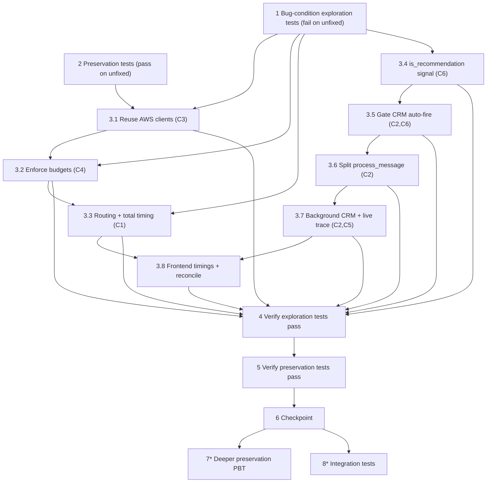

# Implementation Plan: Latency & Trace Fix

## Overview

This plan fixes the six latency/trace defects described in `bugfix.md` §1 (C1–C6) using the contained, low-risk strategy in `design.md` "Fix Implementation". It follows the **exploratory-first** workflow from the Testing Strategy: we first write bug-condition-checking tests that FAIL on the UNFIXED code (proving each defect exists), then write preservation tests that PASS on the UNFIXED code (locking in the non-buggy behavior to keep), and only then implement the fix. After the fix, the same exploration tests must pass (bug fixed) and the same preservation tests must still pass (no regressions).

The fix is deliberately **contained and low-risk** (the AWS Summit demo is 30 September 2026): no new heavy dependencies, and the existing module layout is preserved. Every change is additive or internal — no user-visible reply text and no WebSocket protocol field is removed.

Backend tests use **pytest + Hypothesis**, run with `.\.venv\Scripts\python.exe -m pytest` from `backend/` (`conftest.py` puts `backend/` on `sys.path`). All AWS boundaries (Bedrock, DynamoDB, S3) are mocked with injected fakes / stubs / moto — tests never call real AWS. Frontend verification uses `npm run type-check` and `npm run build` (no frontend test runner is configured).

The two design correctness properties are covered end-to-end:
- **Property 1: Bug Condition** — validates bugfix.md requirements 2.1–2.10.
- **Property 2: Preservation** — validates bugfix.md requirements 3.1–3.13.

Tasks marked with `*` are optional (heavier property-based coverage, frontend build polish). All other tasks are on the demo-critical path.

## Tasks

- [x] 1. Write bug-condition exploration tests (BEFORE any fix)
  - **Property 1: Bug Condition** - Missing timings, foreground CRM, CRM on every License_Advisor turn, client churn, unenforced budgets, buffered/blocking trace
  - **CRITICAL**: These tests MUST FAIL on the UNFIXED code — failure confirms the six defects exist
  - **DO NOT attempt to fix the tests or the code when they fail** at this step
  - **NOTE**: These tests encode the expected post-fix behavior — they will validate the fix when they pass after implementation
  - **GOAL**: Surface concrete counterexamples for each of the six defects (C1–C6) from design.md "Exploratory Bug Condition Checking"
  - **Scoped PBT Approach**: For these deterministic defects, scope each property to concrete failing cases (a greeting message, a recommendation message, a slow-Bedrock stub) so failures are reproducible
  - Drive `process_message` and the `/ws` handler with injected fakes: a fake Orchestrator/Bedrock, a fake DynamoDB table with a call recorder, a client-factory call counter, and a controllable slow-Bedrock stub. Mock all AWS boundaries (no real AWS).
  - C1 (missing timings): assert the `response` payload carries a routing time and a total turn time (fails today — fields absent) — _Requirements: 1.1, 1.2_
  - C2 (foreground CRM + reply pollution): on a recommendation, assert the reply text contains no "Lead ... captured" line and the reply is emitted before the CRM trace (fails today) — _Requirements: 1.3, 1.5_
  - C6 (CRM on a non-recommendation): process a greeting routed to `license_advisor`; assert no lead written, no CRM Trace_Entry, no CRM text (fails today — a lead is written) — _Requirements: 1.4_
  - C3 (client churn): patch the AWS client factory with a call counter; process several messages and assert the factory is invoked once (fails today — invoked per call) — _Requirements: 1.6_
  - C4 (budgets not enforced): inject a Bedrock stub that sleeps beyond the budget; assert the License_Advisor degrades within ~1 s of its 10 s budget and routing within ~1 s of 30 s (fails today — waits the SDK default) — _Requirements: 1.7, 1.8_
  - C5 (buffered trace / blocked loop): assert trace frames arrive incrementally and a concurrent `/ping` responds during a slow turn (fails today — buffered until turn end) — _Requirements: 1.9, 1.10_
  - Run on UNFIXED code with `.\.venv\Scripts\python.exe -m pytest` from `backend/`
  - **EXPECTED OUTCOME**: Tests FAIL (this is correct — it proves the defects exist)
  - Document the observed counterexamples for each defect to confirm the root-cause analysis in design.md "Hypothesized Root Cause"
  - Mark task complete when the tests are written, run, and their failures are documented
  - _Requirements: 1.1, 1.2, 1.3, 1.4, 1.5, 1.6, 1.7, 1.8, 1.9, 1.10_

- [x] 2. Write preservation property tests (BEFORE implementing the fix)
  - **Property 2: Preservation** - Non-buggy inputs behave exactly as before
  - **IMPORTANT**: Follow the observation-first methodology — run the UNFIXED code first, record its outputs, then assert those outputs
  - Observe on UNFIXED code and capture: routing `agent`/`routing_reason` (including the four exact fallback reasons), contract-rejection behavior (no text, no Trace_Entry), Trace_Entry shape (`agent_selected`, `routing_reason`, `tools_used` list, non-negative int `time_ms` for only that step), the `/ws` frame protocol (`{"text":...}` accepted, empty/malformed ignored, incremental `trace` events + one `response` event), history-turn accounting (one user + one assistant turn), the recommendation flow (two entries + one NEW `LEAD-<timestamp>` lead), non-License_Advisor routing (no auto-fire), `/invocations` and `/ping`/`/health`/`/upload-document` responses, per-agent user-visible rules, and credential source
  - Write property-based tests (Hypothesis, 100+ iterations) that generate messages/routing outcomes and assert the captured non-buggy behavior across the input domain, tagged `# Feature: latency-trace-fix, Property 2: Preservation`
  - Mock all AWS boundaries (Bedrock, DynamoDB, S3) with injected fakes / stubs / moto
  - Run on UNFIXED code
  - **EXPECTED OUTCOME**: Tests PASS (this confirms the baseline behavior to preserve)
  - Mark task complete when the tests are written, run, and passing on the unfixed code
  - _Requirements: 3.1, 3.2, 3.3, 3.4, 3.5, 3.6, 3.7, 3.8, 3.9, 3.10, 3.11, 3.12, 3.13_

- [x] 3. Fix the latency & trace defects (C1–C6)

  - [x] 3.1 Reuse process-wide, thread-safe AWS clients (C3) — `backend/bedrock_client.py`, `backend/main.py`, `backend/agents/*`
    - Introduce lazily-created, process-wide client singletons behind a `threading.Lock` (double-checked) so first construction never races: one bedrock-runtime low-level client (reused by `invoke_agent` and the Compliance_Screener parse) and one S3 client (uploads).
    - For DynamoDB, use the thread-safe strategy from design.md: a shared low-level `dynamodb` client with `boto3.dynamodb.types.TypeSerializer` for `put_item`, OR thread-local resource/Table objects (never share a resource/Session across threads).
    - Update `crm_agent._default_table`, `application_intake._default_dynamodb_table`, `compliance_screener`, and `main._default_s3_client` to use the cached clients; keep injected clients/tables working for tests exactly as today.
    - Preserve the SSO-profile-vs-execution-role selection (3.13) — only the caching changes.
    - _Bug_Condition: isBugCondition(input) where c3 = recreatesAwsClientPerCall(input)_
    - _Expected_Behavior: reuse process-wide AWS client setup, safe under concurrent calls (Property 1)_
    - _Preservation: credential resolution unchanged (3.13); injected clients/tables still honored_
    - _Requirements: 2.6_

  - [x] 3.2 Enforce per-call budgets (C4) — `backend/bedrock_client.py`, `backend/orchestrator.py`
    - Attach a `botocore.config.Config(connect_timeout=..., read_timeout=..., retries={"max_attempts": ...})` to the reused clients so per-socket operations are bounded.
    - In `_bedrock_invoke`, actually apply `timeout_s`: run the blocking call under a wall-clock guard (single-worker executor with `future.result(timeout=timeout_s + ε)`) so the agent degrades no more than ~1 s after the budget. Keep the License_Advisor's 10 s budget; keep the Compliance_Screener's parse budget small enough to leave headroom for its 5 s total (falling back to non-model parsing on timeout).
    - In `orchestrator._invoke_sonnet`, avoid blocking on executor shutdown after a timeout (module-level/shared executor or `shutdown(wait=False)`) so the routing timeout fallback returns within ~1 s of the 30 s budget with reason "routing timed out; using default agent".
    - _Bug_Condition: isBugCondition(input) where c4 = callExceedsBudget(input) AND NOT degradesWithinOneSecond(input)_
    - _Expected_Behavior: stop waiting ≤ 1 s after the budget and degrade as specified (Property 1)_
    - _Preservation: fallback degradation unchanged (3.3); routing fallback reasons unchanged (3.1)_
    - _Requirements: 2.7, 2.8_

  - [x] 3.3 Expose routing time and measure total turn time (C1) — `backend/orchestrator.py`, `backend/main.py`
    - Expose the routing (Sonnet) call duration from `Orchestrator.route` (e.g. a `RoutingDecision` field or a returned duration), keeping the existing `agent`/`routing_reason` intact so 3.1/3.4 are preserved.
    - In `process_message`, wrap `orch.route(...)` with `time.perf_counter()` to produce `routing_ms` (measured even when routing falls back). Measure `total_ms` from the start of processing to just before the reply is returned, excluding any background CRM work.
    - Carry `routing_ms` and `total_ms` as report-only additive fields on the final `response` payload (not Trace_Entry records). Log `total_ms`.
    - _Bug_Condition: isBugCondition(input) where c1 = NOT reportsRoutingTime(input) OR NOT reportsTotalTime(input)_
    - _Expected_Behavior: report routing time and total time alongside the trace, no extra Trace_Entry (Property 1)_
    - _Preservation: Trace_Entry shape/per-step time_ms unchanged (3.4); routing semantics unchanged (3.1)_
    - _Requirements: 2.1, 2.2_

  - [x] 3.4 Add a recommendation signal to the License_Advisor (C6) — `backend/agents/license_advisor.py`
    - Add an additive, non-user-visible recommendation signal on the response (e.g. `structured_data["is_recommendation"] = True`) set when the reply recommends exactly one package with its AED cost (R4.2, R4.3) OR offers a custom quote (R4.5). Derive it from the existing `_detect_recommended_package` result PLUS an explicit custom-quote check.
    - Do NOT change any user-visible reply text (3.12). A clarifying question, greeting, packages-mention-without-a-pick, Fallback_Response, or contract-rejected reply leaves the signal false/absent.
    - _Bug_Condition: isBugCondition(input) where c6 involves a License_Advisor reply that is NOT a recommendation_
    - _Expected_Behavior: an explicit recommendation signal drives the CRM gate (Property 1)_
    - _Preservation: License_Advisor packages/costs/149-word cap/clarifying/custom-quote text unchanged (3.12)_
    - _Requirements: 2.4_

  - [x] 3.5 Gate CRM auto-fire on a recommendation and keep its text out of the reply (C2, C6) — `backend/runtime.py`
    - Change `crm_auto_fire` to fire only when `selected_agent == "license_advisor"` AND the primary response signals a recommendation; keep it a no-op (no lead, no trace) otherwise.
    - Keep the CRM confirmation out of the concatenated reply text; surface lead capture solely through the CRM Trace_Entry, which must identify the `LEAD-...` id (via the entry or the CRM response's `structured_data`).
    - Continue rejecting a contract-violating CRM response (no text, no Trace_Entry).
    - _Bug_Condition: isBugCondition(input) where c6 = license_advisor AND NOT is_recommendation AND crmInvoked(input); c2 = crmTextAppendedToReply(input)_
    - _Expected_Behavior: invoke CRM, create a lead, and produce a CRM Trace_Entry only on a recommendation; keep CRM text out of the reply (Property 1)_
    - _Preservation: contract rejection (3.2); recommendation flow of two entries + one NEW lead (3.8); non-License_Advisor routing no auto-fire (3.9)_
    - _Requirements: 2.4, 2.5_

  - [x] 3.6 Split process_message for foreground/background CRM (C2) — `backend/main.py`
    - Split `process_message` so it returns the reply as soon as the primary + chain complete, exposing a separate callable for the CRM step that the transport layer schedules: foreground for `/invocations` (still waits and returns the complete trace including the CRM entry), background for `/ws`.
    - Keep `/invocations` returning HTTP 200 with reply + complete trace (including the CRM entry when invoked) and a safe 200 on a processing error (3.10).
    - _Bug_Condition: isBugCondition(input) where c2 = crmRunsBeforeReply(input) on the ws path_
    - _Expected_Behavior: reply sent without waiting for CRM on the ws path; /invocations still waits (Property 1)_
    - _Preservation: /invocations HTTP 200 + complete trace + safe fallback (3.10); history one user + one assistant turn, background CRM appends none (3.6)_
    - _Requirements: 2.3_

  - [x] 3.7 Non-blocking background CRM, live streamed trace, and off-loop execution (C2, C5) — `backend/main.py`
    - Run `process_message` off the event loop (`await loop.run_in_executor(...)`) so the async `/ws` handler does not block other connections and `/health`/`/ping` stay responsive.
    - Stream each Trace_Entry the instant it is produced: the sync `emit_trace` enqueues onto an `asyncio.Queue` (thread-safe hand-off via `run_coroutine_threadsafe` / `call_soon_threadsafe`); a single serialized sender task forwards frames in order so the reply and a possibly-later CRM trace never interleave on one socket.
    - After sending the `response`, schedule the CRM step as an asyncio background task (blocking work via `run_in_executor`) and emit its Trace_Entry through the same sender when it completes. Guard it so a CRM failure is logged and swallowed (never fails the reply or closes the socket), the background step does not delay the next message, and the lead write still completes if the client disconnected (do not cancel on disconnect; detach the write from the send).
    - Tag events with a per-turn correlation id (additive field) so a late CRM trace can be reconciled to its message after the next message is sent. Keep existing event shapes consumable (3.5).
    - _Bug_Condition: isBugCondition(input) where c2 (foreground CRM) and c5 = traceBufferedUntilReply(input) OR blocksEventLoopDuringTurn(input)_
    - _Expected_Behavior: background non-blocking CRM; each trace streamed as its step completes; loop stays responsive (Property 1)_
    - _Preservation: ws frame protocol and event shapes (3.5); lead still recorded on disconnect and two-entry flow (3.8)_
    - _Requirements: 2.3, 2.9, 2.10_

  - [x] 3.8 Render timings and reconcile the late CRM trace on the frontend — `frontend/src/components/ChatPanel.tsx`, `TracePanel.tsx`, `TraceCard.tsx`, `frontend/src/types.ts`
    - Add the additive report-only fields (`routing_ms`, `total_ms`, per-turn correlation id) to `types.ts`, keeping the existing event shapes consumable.
    - Render routing time and total time in the panel without a Trace_Entry; reconcile a CRM trace that arrives after the `response` (before or after) to its message via the per-turn id so both entries display.
    - Verify with `npm run type-check` and `npm run build` (no frontend test runner is configured).
    - _Bug_Condition: isBugCondition(input) where c1 (timings) and c2/c5 (late CRM trace) surface to the UI_
    - _Expected_Behavior: Trace_Panel displays routing/total time and both entries regardless of CRM arrival order (Property 1)_
    - _Preservation: existing `trace`/`response` event shapes still consumed by the frontend (3.5)_
    - _Requirements: 2.1, 2.2, 2.5_

- [x] 4. Verify the bug-condition exploration tests now pass
  - **Property 1: Bug Condition** - Timings, background CRM, recommendation-gated lead, reused clients, enforced budgets, live trace
  - **IMPORTANT**: Re-run the SAME tests from task 1 — do NOT write new tests
  - The tests from task 1 encode the expected behavior; when they pass they confirm each of C1–C6 is resolved
  - Run the bug-condition exploration tests with `.\.venv\Scripts\python.exe -m pytest` from `backend/`
  - **EXPECTED OUTCOME**: Tests PASS (confirms the six defects are fixed)
  - _Requirements: 2.1, 2.2, 2.3, 2.4, 2.5, 2.6, 2.7, 2.8, 2.9, 2.10_

- [x] 5. Verify the preservation tests still pass
  - **Property 2: Preservation** - Non-buggy inputs behave exactly as before
  - **IMPORTANT**: Re-run the SAME tests from task 2 — do NOT write new tests
  - Run the preservation property tests with `.\.venv\Scripts\python.exe -m pytest` from `backend/`
  - **EXPECTED OUTCOME**: Tests PASS (confirms no regressions across requirements 3.1–3.13)
  - Confirm all existing backend tests (including `tests/test_agent_contract.py`) still pass after the fix
  - _Requirements: 3.1, 3.2, 3.3, 3.4, 3.5, 3.6, 3.7, 3.8, 3.9, 3.10, 3.11, 3.12, 3.13_

- [x] 6. Checkpoint - Ensure all tests pass
  - Run the full backend suite with `.\.venv\Scripts\python.exe -m pytest` from `backend/`; confirm exploration tests pass, preservation tests pass, and the existing suite is green.
  - Run `npm run type-check` and `npm run build` for the frontend.
  - Ensure all tests pass; ask the user if questions arise.

- [~] 7.* Write additional preservation property-based tests (optional, deeper coverage)
  - **Property 2: Preservation** - Byte-identical `message`/`trace` before vs after for non-buggy inputs
  - Generate messages/routing outcomes with Hypothesis and assert non-buggy inputs give byte-identical `message`/`trace` before vs after; generate License_Advisor replies (recommendations vs non-recommendations) and assert the CRM fires iff the reply is a recommendation; generate concurrent-call scenarios and assert reused clients stay safe (no shared non-thread-safe resource across threads) and the client factory is invoked once.
  - Tag `# Feature: latency-trace-fix, Property 2: Preservation`; mock all AWS boundaries.
  - _Requirements: 3.1, 3.4, 3.8, 3.9, 2.6_

- [~] 8.* Write integration tests for the full WebSocket turn (optional)
  - Full `/ws` turn: reply arrives before the background CRM trace; the CRM trace arrives later and is reconciled via the per-turn id; a CRM failure does not close the socket or fail the reply.
  - Lead still recorded when the client disconnects immediately after the reply.
  - Concurrency: a slow turn on one connection does not block a `/ping`/`/health` probe or a second connection's turn.
  - `/invocations` waits for CRM and returns the complete trace including the CRM entry.
  - _Requirements: 2.3, 2.9, 2.10, 3.10_

## Notes

- Tasks marked with `*` are optional (deeper property-based coverage and integration tests) and can be skipped for a faster demo path; the demo-critical implementation path is all unmarked tasks.
- The workflow is exploratory-first: task 1 writes bug-condition tests that FAIL on the unfixed code, task 2 writes preservation tests that PASS on the unfixed code, task 3 implements the fix, and tasks 4–5 re-run the SAME tests to confirm the fix and the absence of regressions.
- Property-based tests use Hypothesis with 100+ iterations each, one test per property, tagged `# Feature: latency-trace-fix, Property N: ...`, with Bedrock/DynamoDB/S3 mocked. Backend tests run with `.\.venv\Scripts\python.exe -m pytest` from `backend/`.
- The fix is additive/internal only: no user-visible reply text and no WebSocket protocol field is removed, so the existing frontend keeps consuming the `trace`/`response` events.

### Requirement coverage
- Bug Condition (Property 1): R2.1, R2.2 → 3.3; R2.3 → 3.6, 3.7; R2.4, R2.5 → 3.4, 3.5, 3.8; R2.6 → 3.1; R2.7, R2.8 → 3.2; R2.9, R2.10 → 3.7. Explored in task 1, verified in task 4.
- Preservation (Property 2): R3.1–R3.13 observed and asserted in task 2, verified in task 5 (deeper coverage in task 7*).

### Defect → fix task mapping
- C1 (missing timings) → 3.3
- C2 (foreground CRM + reply pollution) → 3.5, 3.6, 3.7
- C3 (AWS client churn) → 3.1
- C4 (unenforced budgets) → 3.2
- C5 (buffered trace / blocked loop) → 3.7
- C6 (CRM on every License_Advisor turn) → 3.4, 3.5

## Task Dependency Graph



```json
{
  "waves": [
    { "id": 0, "tasks": ["1", "2"] },
    { "id": 1, "tasks": ["3.1", "3.4"] },
    { "id": 2, "tasks": ["3.2", "3.5"] },
    { "id": 3, "tasks": ["3.3", "3.6"] },
    { "id": 4, "tasks": ["3.7"] },
    { "id": 5, "tasks": ["3.8"] },
    { "id": 6, "tasks": ["4"] },
    { "id": 7, "tasks": ["5"] },
    { "id": 8, "tasks": ["6"] },
    { "id": 9, "tasks": ["7", "8"] }
  ]
}
```
